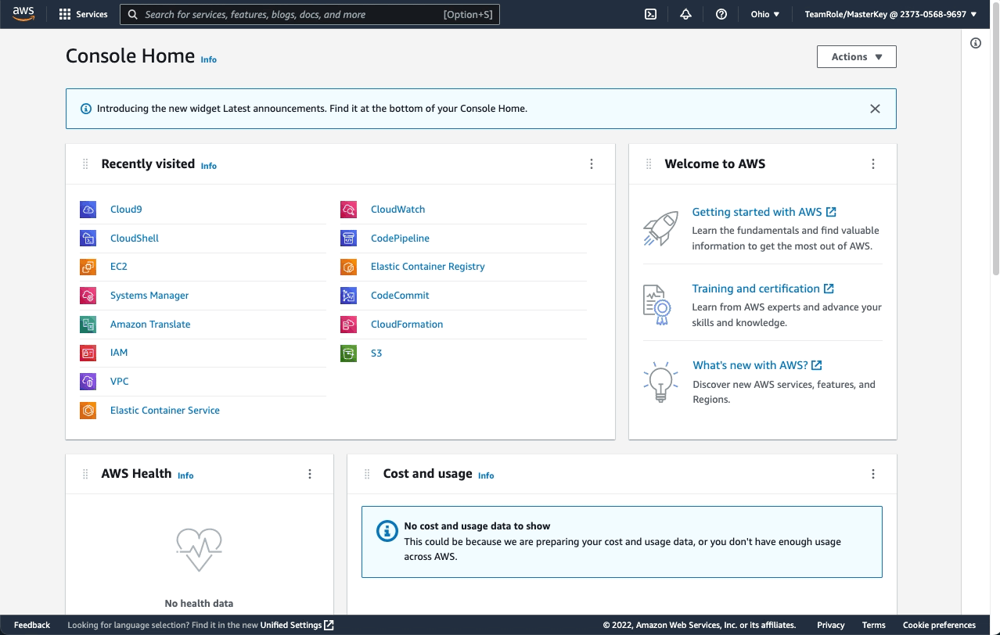

# LATAM Containers Roadshow - Workshop de Amazon ECS

[**< Voltar**](./README_ptBR.md)

## Capítulo 1 - Preparar o Ambiente de Trabalho

Antes da gente começar a meter a mão na massa e explorar o Amazon Elastic Container Service (ECS), precisamos preparar o nosso ambiente de trabalho. Nesse workshop vamos usar o AWS Cloud9 para executar as atividades, que fornece um ambiente integrado de desenvolvimento para escrever, executar e depurar código usando apenas um navegador. Esse ambiente já foi provisionado através de uma automação feita pelo Amazon CloudFormation (código disponível em `helpers/cloudformation-cloud9-template.yaml`), um serviço de infraestrutura como código (IaC) que permite facilmente modelar, provisionar e gerenciar recursos da AWS.

Entretanto, precisamos realizar uma pequena modificação que não foi possível automatizar:

1. Seguindo os passos descritos inicialmente aqui no repositório, vamos acessar a console do seviço AWS Cloud9 e abrir o nosso ambiente chamado `latamcontainersroadshow`:



2. Vamos garantir que não estamos usando credenciais temporárias do AWS Cloud9 para a execução das atividades pois elas são incompatíveis com o AWS Copilot e vão gerar problemas:


3. Dentro do ambiente AWS Cloud9, usando o terminal embarcado, vamos configurar o AWS CLI v2 usando o IAM User `worksho-user` e a credential de acesso criados para o workshop. E para isso, vamos usar do AWS CLI para obter os dados de saída do stack de automação, popular variáveis de ambiente, e gerar o arquivo de configuração final necessário:

```bash
export WORKSHOP_CFN_STACK_NAME=$(aws cloudformation list-stacks --query 'StackSummaries[?StackStatus == `CREATE_COMPLETE` && contains(@.StackName, `mod`)].StackName' --output text)
export WORKSHOP_USER_KEYID=$(aws cloudformation describe-stacks --stack-name $WORKSHOP_CFN_STACK_NAME --query 'Stacks[].Outputs[? OutputKey == `WorkshopUserKeyId`].OutputValue' --output text)
export WORKSHOP_USER_SECRET=$(aws cloudformation describe-stacks --stack-name $WORKSHOP_CFN_STACK_NAME --query 'Stacks[].Outputs[? OutputKey == `WorkshopUserKeySecret`].OutputValue' --output text)

cat <<EOF > ~/.aws/config
[default]
region=$(curl -s http://169.254.169.254/latest/dynamic/instance-identity/document | jq .region -r)
output=json
EOF

cat <<EOF > ~/.aws/credentials
[default]
aws_access_key_id = $WORKSHOP_USER_KEYID
aws_secret_access_key = $WORKSHOP_USER_SECRET
EOF
```

4. Depois precisamos validar que de fato vamos estar usando o IAM User `workshop-user` com o seguinte comando:

```bash
aws sts get-caller-identity
```


Isso é tudo! Vamos começar a criar nosso ambiente do Amazon ECS com a CLI do AWS Copilot.

[**Próximo >**](./2-Build.md)

<details>
<summary style="font-size:14px">Opcional - Como instalar prerequisitos?</summary>
<br/>

Se você estiver disposto a executar as etapas em sua própria máquina, precisará executar todas as próximas etapas para garantir que tenhamos todas as ferramentas necessárias para os exercícios.

1. Primeiro, vamos nos certificar de que estamos executando os pacotes de sistema mais recentes e temos as dependências mínimas instaladas. Se você estiver executando uma distribuição Linux baseada em RHEL/AL2, precisará executar:

```bash
sudo yum update -y
sudo yum install -y vim git jq bash-completion moreutils gettext yum-utils
```

2. Além disso, precisamos garantir que a versão 2 mais recente da AWS Command Line Interface (CLI) esteja disponível:

```bash
cd ~/environment
curl "https://awscli.amazonaws.com/awscli-exe-linux-x86_64.zip" -o "awscliv2.zip"
unzip awscliv2.zip
sudo ./aws/install --update
rm -rf aws awscliv2.zip
aws --version
```

3. Depois de instalado, você precisa configurar corretamente sua AWS CLI com as credenciais adequadas para a conta da AWS de destino. Essa credencial vai estar atrelada à um IAM User já previamente criado, e que tenha uma IAM Policy adequada (acompanhar [aws/copilot-cli#1345](https://github.com/aws/copilot-cli/issues/1345)).

```bash
aws configure
```

4. Em seguida, vamos instalar a versão mais recente da CLI do AWS Copilot e habilitar o preenchimento automático do bash:

```bash
cd ~/environment
curl -Lo copilot https://github.com/aws/copilot-cli/releases/latest/download/copilot-linux
chmod +x copilot
sudo mv copilot /usr/local/bin/copilot
sudo sh -c '/usr/local/bin/copilot completion bash > /etc/bash_completion.d/copilot'
copilot --version
```
</details>