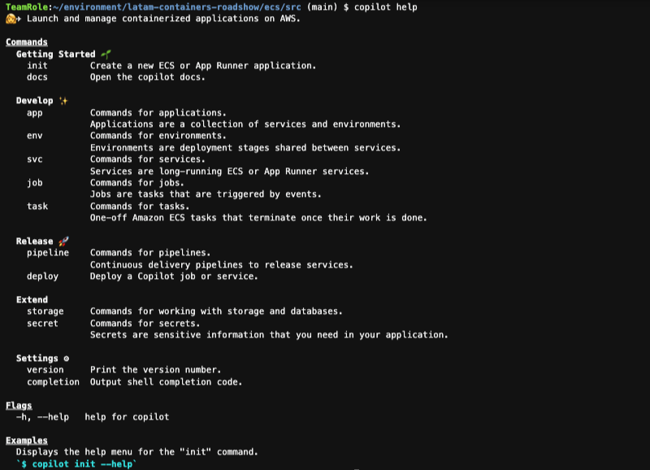
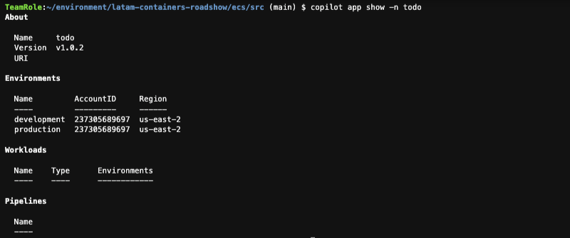

# LATAM Containers Roadshow - Workshop de Amazon ECS

[**< Voltar**](./1-Prepare.md)

## Capítulo 2 - Construindo a Infraestrutura

Agora que temos tudo o que precisamos em nosso ambiente de trabalho, neste capítulo vamos construir a infraestrutura que hospedará nossa aplicação em containers. Este workshop explorará como aproveitar o Amazon Elastic Compute Service (ECS) para operar contêineres em escala, aproveitando o vasto ecossistema de serviços AWS, sem comprometer a simplicidade operacional do ambiente.

Existem várias maneiras de provisionar infraestrutura na AWS, como usar o AWS CloudFormation, o AWS Cloud Development Kit (CDK) ou o Hashicorp Terraform. Nesse workshop vamos usar o AWS Copilot, que simplifica a criação e operação de aplicações conteinerizadas na AWS, incorporando as boas práticas para desenvolvimento de arquiteturas nativas de nuvem.

1. Vamos inicialmente clonar o repositório base do workshop para reaproveitar alguns dos artefatos e usar como espaço para inicialização do AWS Copilot.

```bash
cd ~/environment/
git clone https://github.com/davivcgarcia/latam-containers-roadshow.git
cd latam-containers-roadshow/ecs/src/
```

2. A AWS Copilot é uma ferramenta de linha de comando, e já se encontra disponível no nosso ambiente de trabalho do AWS Cloud9. Vamos explorar quais são as opções disponíveis. Você pode usar desse comando com outros para explorar as opções de parâmetros.

```bash
copilot help
```



3. Vamos seguir e inicializar nossa `Application` do AWS Copilot chamada `todo`. Essa construção representa uma descrição alto nível da aplicação que estamos tentando construir, e é uma coleção de `Services` e `Environments` (que ainda vamos ver o que são). Para isso, vamos executar o comando abaixo:

```bash
copilot app init todo
```


4. Esse comando criou recursos como IAM Role e parâmetros no AWS System Manager Parameter Store através do AWS CloudFormation, que permitem a ferramenta gerenciar outros componentes como `Services` e `Jobs`. Podemos listar as aplicações AWS Copilot com:

```bash
copilot app ls
```


5. Além disso, ele criou uma estrutura de diretórios a partir de onde o comando de inicialização foi executado, onde ele armazena os arquivos de configuração dos componentes relacionados ao AWS Copilot. Esse diretório ainda está praticamente vazio, mas ele vai ficar mais cheio em breve!

```bash
tree -a .
```


6. Uma vez que a nossa `Application` foi criada, vamos criar os `Environments` no AWS Copilot. Estes são de fato as infraestruturas que suportam as nossas `Applications` e, que no nosso caso, será baseada em Amazon Elastic Container Service (ECS) e AWS Fargate. Estamos usando a opção `--container-insights` para sinalizar que queremos a ativar a integração com Amazon CloudWatch, o nosso serviço de observabilidade integrada de logs e métricas. Vamos primeiro criar o nosso ambiente de desenvolvimento:

```bash
copilot env init --app todo --name development --container-insights
```

Use as seguintes respostas:
- Which credentials would you like to use to create development? **[profile default]**
- Would you like to use the default configuration for a new environment? **Yes, use default.**


7. Perceba que o AWS Copilot criou uma série de recursos, dentre eles uma Virtual Private Cloud (VPC), IAM Roles e o nosso cluster de Amazon ECS. O AWS Copilot usa o AWS Fargate como motor de execução serverless para os nossos containers (não há instâncias de Amazon EC2 a serem gerenciadas). Toda essa configuração de recursos se dá através do AWS CloudFormation.


8. Vamos repetir o processo para criar nosso ambiente produtivo. Poderíamos estar usando contas AWS diferentes, mas por conta da limitação dos laboratórios vamos ter ambos ambientes na mesma conta, mas em Virtual Private Clouds (VPCs) diferentes. Dessa vez vamos usar a opção `--default-config` para ele seguir com a opçào de infraestrutura padrão, e a opção `--prod` para sinalizar que esse será um ambiente de produção.

```bash
copilot env init --app todo --name production --container-insights --default-config --prod
```


9. Uma vez que criamos os nossos ambientes de desenvolvimento e produção, vamos olhar como ficou a definição até o momento da nossa `Application`. Na saída do comando vemos a informação alto nível da aplicação, e quais são os ambientes envolvidos. Perceba que ele deixa claro qual o AWS Account ID e AWS Region, porque ele pode ligar com ambientes em regiões e contas diferentes!

```bash
copilot app show -n todo
```



Está tudo pronto pra implantarmos os componentes da nossa aplicação `todo`!

[**Próximo >**](./3-Deploy.md)